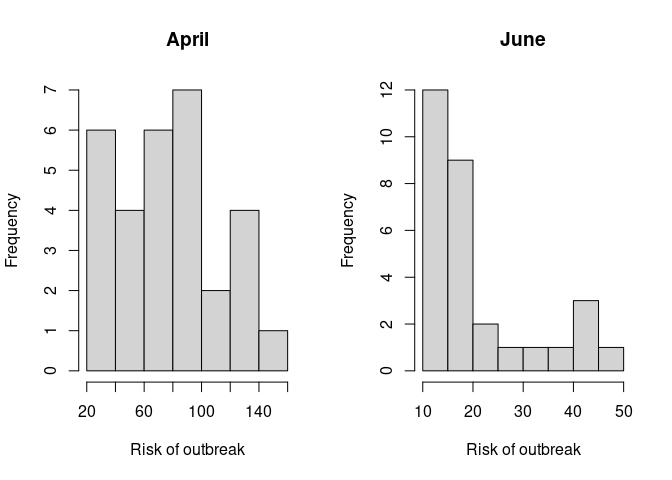

# Objectives

The learning objectives for this practical are:

-   How to create and use list objects.
-   How to perform implicit looping through lists.
-   Learn visualizing data in different ways.

# Setup and background

To do this practical you need an installation of R and RStudio. You can
find the instructions in the [setup](/setup#r-and-rstudio) link on how
to install R and RStudio in your system. For a smooth development of
this practical, it is strongly recommended that you follow and finish
the previous [practical 7](/practical7/).

We will download some COVID19 data to illustrate the use of R and
RStudio. Please follow the next two steps:

1.  Go to the Catalan Health Departament COVID19 data portal at
    <https://dadescovid.cat> and switch the language to “ENGLISH” using
    the pull-down menu on the top-right corner of the page.
2.  Follow the downloads link and on the next page click and download
    the file corresponding to the “7 DAY AGGREGATION” for “CATALUNYA”.
    Make sure you know exactly where in your filesystem this file has
    been downloaded. **Tip:** some browsers automatically download files
    into a folder called “Downloads” or under a name corresponding to
    the translation of “Downloads” to the default language of your
    operating system.
3.  Make a directory in your filesystem, for instance at your *home*
    directory, called `practical9` and copy in it the downloaded file.
4.  Since the downloaded file is a ZIP file, uncompress as you did in
    [practical 1](/practical1/) so that you finally have a file called
    `catalunya_setmanal.csv` in the directory `practical9`.

If you are using the UPF [myapps](https://myapps.upf.edu) cloud to run
RStudio, then you need to either use an internet browser in *myapps* to
download the data file directly in the *myapps* cloud or upload to the
*myapps* cloud the file that you have downloaded in your own computer.

# Lists and implicit looping

Lists allow one to group values through their elements. Let’s say we
want to group the values of the risk of outbreak in the previous data,
by the month in which the data belongs to. We can do that using the
function `split()` to which we should give a first argument of the
values we want to group and a second argument with the grouping factor.

    > iepgbymonth <- split(datg$IEPG_CONFIRMAT, mf)
    > class(iepgbymonth)

    [1] "list"

    > length(iepgbymonth)

    [1] 10

    > names(iepgbymonth)

     [1] "Feb" "Mar" "Apr" "May" "Jun" "Jul" "Aug" "Sep" "Oct" "Nov"

    > head(iepgbymonth, n=3)

    $Feb
    [1] NA NA NA NA NA NA

    $Mar
     [1] 154.523 168.052 176.403 188.101 206.879 225.887 245.803 263.842 275.744
    [10] 289.553 309.236 349.668 374.001 392.650 410.941 411.181 445.455 452.179
    [19] 398.809 346.643 284.823 225.282 144.230 107.113      NA      NA      NA
    [28]      NA      NA      NA      NA

    $Apr
     [1]  24.1050  26.1615  28.3733  31.1514  33.6115  36.4087  42.9276  46.9114
     [9]  51.8729  57.1702  61.3704  64.4527  68.6624  71.0281  76.4523  78.9826
    [17]  82.4250  86.9431  87.4165  86.3060  87.9184  92.1927  98.2542 105.1500
    [25] 118.3170 121.8560 124.6690 130.1430 136.0640 144.0100

Grouping values can be useful in data analysis when we want to examine
the data separately by groups. Let’s say we want to visualize the
distribution of values of the risk of outbreak for the month of April
and June, next to each other. We can use the function `hist()` for that
purpose, creating a grid of two plotting panes using the `par()`
function, as follows:

    > par(mfrow=c(1, 2))
    > hist(iepgbymonth$Apr, xlab="Risk of outbreak", main="April")
    > hist(iepgbymonth$Jun, xlab="Risk of outbreak", main="June")

Now, let’s calculate the mean of the risk of outbreak for the month of
April. Having built the previous `list` object, we can make that
calculation applying the function `mean()` to the corresponding element
of the list:

    > mean(iepgbymonth$Apr)

    [1] 76.71023

Let’s say we want to compare this value with the mean value for the
month of March:

    > mean(iepgbymonth$Mar)

    [1] NA

Here we got an `NA` value because the month of March has missing values
for some weeks and, by default, the function `mean()` propagates that
`NA` value to the result. We can ask the `mean()` function to exclude
`NA` values and do the calculation on the non-missing ones using the
argument `na.rm=TRUE`:

    > mean(iepgbymonth$Mar, na.rm=TRUE)

    [1] 285.2916

It would be tedious to do that calculation for each different month by
writing one such function call for each element of the list. As an
alternative, we could use a `while` or `for` loop that would iterate
over the elements of the list. However, R provides a more compact way to
iterating over lists, and other objects, by using functions for
*implicit*
[looping](https://cran.r-project.org/doc/manuals/r-release/R-lang.html#Looping)
such as `lapply()` or `sapply()`. These functions take a list as a first
argument, iterate through each element of that list, and at each
iteration apply the function given in the second argument. Additional
arguments can be given and will be passed to the *applied* function.

The function `lapply()` returns again the input list with its elements
replaced by the result given by the function on each corresponding
element, while the function `sapply()` attempts to simplify the
resulting data structure in that if each element of the resulting list
has length 1, then it return an atomic vector.

We can calculate the mean of the risk of outbreak per month with the
following call to the `sapply()` function:

    > sapply(iepgbymonth, mean, na.rm=TRUE)

          Feb       Mar       Apr       May       Jun       Jul       Aug       Sep 
          NaN 285.29158  76.71023  25.66524  20.77437 153.58826 190.42042 207.93477 
          Oct       Nov 
    702.40661 607.29200 

where here the argument `na.rm=TRUE` is passed by `sapply()` to each
call to the `mean()` function. Try the same call using the `lapply()`
function and notice the difference in the output.

Plot the distribution of the number of deaths (column `EXITUS`) per
month in the general population (using box plots). Calculate the mean of
the number of deaths per month in the general population and plot it
over the previous box plots using the function `points()`. Check the
help page of `points()` to find out how to use it, figure out how make
the plotted point to be a solid diamond (**hint:** look at the argument
`pch`).
