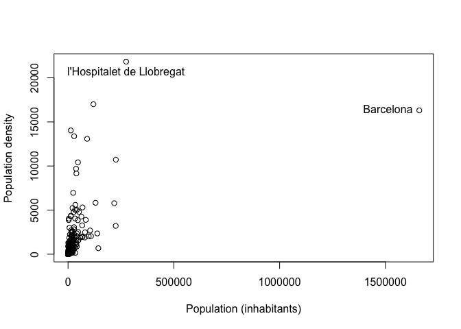

Objectives
==========

The learning objectives for this practical are:

-   How to create and use list objects.
-   How to perform implicit looping through lists.
-   Add new columns to data frames.
-   How to merge data frames.
-   Learn to explore and visualize data in different ways.

Setup and background
====================

To do this practical you need an installation of R and RStudio. You can
find the instructions in the [setup](/setup#r-and-rstudio) link on how
to install R and RStudio in your system. For a smooth development of
this practical, it is strongly recommended that you follow and finish
the previous [practical 7](/practical7/).

We will download COVID19 vaccination and demographic data for Catalonia
to illustrate some data wrangling in R and RStudio. Please follow the
next two steps:

-   **COVID19 vaccination by municipality**:

    1.  We will download the COVID19 vaccination data by municipality
        from the [open data
        portal](https://analisi.transparenciacatalunya.cat/Salut/Vacunaci-per-al-COVID-19-dosis-administrades-per-m/irki-p3c7).
        However, this data portal provides the data as an uncompressed
        CSV file of over 100MB large, which may take few minutes to
        download. You can download a compressed ZIP version of this file
        from this
        [link](Vacunaci__per_al_COVID-19__dosis_administrades_per_municipi.zip).
        Once downloaded, you will have to uncompress it to obtain the
        CSV file using the instruction:

            $ unzip Vacunaci__per_al_COVID-19__dosis_administrades_per_municipi.zip

    2.  Make a directory in your filesystem, for instance at your *home*
        directory, called `practical8` and copy in it the downloaded
        file.
    3.  **Change the name of the file you just downloaded to
        `dosis_municipi.csv`**, so that you finally have a file called
        `dosis_municipi.csv` in the directory `practical8`.

-   **Population by municipality**:

    1.  Download the Catalan Urbanistic Map dataset at the [Dades
        Obertes de
        Catalunya](https://governobert.gencat.cat/ca/dades_obertes) data
        portal. You can either click on the link at the bottom right
        called “Access the catalog” and then search for “Dades del mapa
        urbanístic de Catalunya” or directly go to the following
        [link](https://analisi.transparenciacatalunya.cat/en/Urbanisme-infraestructures/Dades-del-mapa-urban-stic-de-Catalunya/epsm-zskb).
        Once you are on the page entitled “Dades del mapa urbanístic de
        Catalunya”, download the data by going to the top right corner
        and select “Export” and then “CSV”. This dataset includes
        information of the population of Catalonia by municipality.
    2.  Copy the downloaded file to the `practical8` directory and
        **change its name to `poblacio_municipis.csv`**.

Reading and filtering data
==========================

Let’s load the CSV file `poblacio_municipis.csv`, which contains some
demographic indicators for the 948 municipalities in Catalonia such as
the population (column `Poblacio_padro`).

    > pop <- read.csv("poblacio_municipis.csv")
    > dim(pop)

    [1] 10428    69

    > head(pop, n=3)

       Any Codi_ine_5_txt Codi_ine_6_txt       NomMun     Comarca AFT Costa
    1 2012           8025          80253      el Bruc       Anoia  PE     0
    2 2012           8026          80266     el Brull       Osona  CC     0
    3 2012           8027          80272 les Cabanyes Alt Penedès  PE     0
              Muntanya Poblacio_padro Superficie_ha   X05_SU X05_perce_SU  X05_SUC
    1                            2029     4733.5830 140.6794       2.9719 138.1059
    2 Zona de muntanya            261     4153.0043  28.5859       0.6883  28.1810
    3                             947      115.5193  23.8846      20.6759  23.3431
      X05_perce_SUC X05_SNC X05_perce_SNC X05_SURB X05_perce_SUR X05_SUD
    1        2.9176  2.5736        0.0544   6.6230        0.1399  6.6230
    2        0.6786  0.4049        0.0097  25.1602        0.6058 25.1602
    3       20.2071  0.5416        0.4688  18.5540       16.0614 18.5540
      X05_perce_SUD X05_SND X05_perce_SND   X05_SNU X05_perce_SNU X06_Class_no_SNU
    1        0.1399       0             0 4586.2805       96.8881         147.3025
    2        0.6058       0             0 4099.2582       98.7059          53.7461
    3       16.0614       0             0   73.0806       63.2627          42.4387
      X06_perce_Class_no_snu X07_densitat_pob_km2 X08_densitat_pob_urba_Km2
    1                 3.1119              42.9872                 1442.2863
    2                 1.2941               6.3583                  913.0373
    3                36.7373             822.1686                 3964.8912
      X09_Perce_SNC_SU X10_Perce_SUD_SU X11_Perce_SND_SU X012_Qual_SUC_AE
    1           1.8294           4.7079                0          11.7035
    2           1.4164          88.0161                0           0.0000
    3           2.2674          77.6819                0           0.0000
      X12_A1_SUC X12_A2_SUC X12_A3_SUC X13_Qual_SUC_R X13_R1_SUC X13_R2_SUC
    1    11.7035          0          0        85.9369     0.9245     0.0000
    2     0.0000          0          0        20.3507     0.0000     0.0000
    3     0.0000          0          0        13.8351     5.0349     5.0386
      X13_R3_SUC X13_R4_SUC X13_R5_SUC X13_R6_SUC X14_Qual_SUC_Altres X14_M1_SUC
    1          0          0     8.2275    76.7850              2.7536          0
    2          0          0     0.0000    20.3507              0.1780          0
    3          0          0     0.0000     3.7615              1.1516          0
      X14_M2_SUC X14_M3_SUC X15_Qual_SUC_SISTEMES X15_SA_SUC X15_SC_SUC X15_SD_SUC
    1     2.7536          0               37.7864          0          0          0
    2     0.1780          0                7.6725          0          0          0
    3     1.1516          0                8.3682          0          0          0
      X15_SE_SUC X15_SF_SUC X15_SH_SUC X15_SP_SUC X15_SS_SUC X15_ST_SUC X15_SV_SUC
    1     2.5910          0          0          0     3.6376     0.0000    11.0487
    2     2.0338          0          0          0     0.0000     0.7045     2.4458
    3     0.6412          0          0          0     0.0000     0.0192     2.0692
      X15_SX0_SUC X15_SX1_SUC X15_SX2_SUC X16_QUAL_snu X16_N1_SNU X16_N2_SNU
    1      0.0548      9.4575     10.9968    4422.1847  2004.9363  2406.4240
    2      0.0000      1.1271      1.3614    4028.5438   547.4568   739.7637
    3      0.0000      3.2580      2.3806      64.2643    27.6080    36.6563
      X16_N3_SNU X16_N4_SNU X17_Sol_resid_habt X18_Sol_AE_habt X19_Zverdes_habt
    1      0.000    10.8243           423.5432         57.6813          54.4542
    2   2741.323     0.0000           779.7221          0.0000          93.7075
    3      0.000     0.0000           146.0939          0.0000          21.8498
      X20_Equip_habt
    1        12.7696
    2        77.9217
    3         6.7704

    > table(pop$Any)

    2012 2013 2014 2015 2016 2017 2018 2019 2020 2021 2022 
     948  948  948  948  948  948  948  948  948  948  948 

We can observe that this dataset contains data from different years. To
continue with our analysis, we will select the most recent data
corresponding to 2022 and, moreover, we will only keep the columns
`Codi_ine_5_txt` (identifier for the municipality), `NomMun`, `Comarca`,
`Poblacio_padro` and `Superficie_ha`, corresponding to town identifier,
town name, county, population, town surface in
[hectare](https://en.wikipedia.org/wiki/Hectare) (ha), respectively.

    > ## build a logical mask to select for year 2022
    > mask <- pop$Any == 2022
    > ## build a character string vector of the selected columns
    > selcols <- c("Codi_ine_5_txt", "NomMun", "Comarca", "Poblacio_padro", "Superficie_ha")
    > ## subset the data.frame object 'pop' for rows in 'mask' and columns in 'selcols'
    > pop_sel <- pop[mask, selcols]
    > dim(pop_sel)

    [1] 948   5

    > head(pop_sel)

         Codi_ine_5_txt               NomMun         Comarca Poblacio_padro
    9481           8001               Abrera  Baix Llobregat          12697
    9482           8002   Aguilar de Segarra           Bages            287
    9483           8003               Alella         Maresme          10079
    9484           8004               Alpens        Lluçanès            281
    9485           8005 l'Ametlla del Vallès Vallès Oriental           9020
    9486           8006        Arenys de Mar         Maresme          16155
         Superficie_ha
    9481     1997.8648
    9482     4321.9825
    9483      961.9331
    9484     1377.8822
    9485     1436.2999
    9486      649.1550

Lists and implicit looping
==========================

Lists allow one to group values through their elements. Let’s say we
want to group the population number by county. We can do that using the
function `split()` to which we should give a first argument of the
values we want to group and a second argument with the grouping factor.

    > pbyc <- split(pop_sel$Poblacio_padro, pop_sel$Comarca)
    > class(pbyc)

    [1] "list"

    > length(pbyc)

    [1] 43

    > names(pbyc)

     [1] "Alt Camp"          "Alt Empordà"       "Alt Penedès"      
     [4] "Alt Urgell"        "Alta Ribagorça"    "Anoia"            
     [7] "Bages"             "Baix Camp"         "Baix Ebre"        
    [10] "Baix Empordà"      "Baix Llobregat"    "Baix Penedès"     
    [13] "Barcelonès"        "Berguedà"          "Cerdanya"         
    [16] "Conca de Barberà"  "Garraf"            "Garrigues"        
    [19] "Garrotxa"          "Gironès"           "Lluçanès"         
    [22] "Maresme"           "Moianès"           "Montsià"          
    [25] "Noguera"           "Osona"             "Pallars Jussà"    
    [28] "Pallars Sobirà"    "Pla d'Urgell"      "Pla de l'Estany"  
    [31] "Priorat"           "Ribera d'Ebre"     "Ripollès"         
    [34] "Segarra"           "Segrià"            "Selva"            
    [37] "Solsonès"          "Tarragonès"        "Terra Alta"       
    [40] "Urgell"            "Val d'Aran"        "Vallès Occidental"
    [43] "Vallès Oriental"  

    > head(pbyc)

    $`Alt Camp`
     [1]   961  5290   496   687  1254   332   196   285   189   419   173   541
    [13]  2340   492  1199   572   552   506   395  1882 24727   711  1341

    $`Alt Empordà`
     [1]   903   180   625  1043  1676    87  1034   776   258   949   279  2889
    [13]   330   672 11611   307   178   468   535 10520   408 47088   778   458
    [25]   922  3317   827  4905  1245   294   724   202  1465   373   115  1472
    [37]   579   181  1974   542   274  1090  1015   210   244 19907   696   267
    [49]   808   159  2079   379   865   220   345   741   911   991   479  5562
    [61]   162  1142   386  1166   204   401   785   249

    $`Alt Penedès`
     [1]  1706   999  2474  1614  1446  7814  2207  2517  3884  2016   935  1335
    [13]   507   555  1009  2503  3313  2404  2393 12863   370  7624  3241  1457
    [25]  2557  1130 40056

    $`Alt Urgell`
     [1]   329   163    80   223    98    51   548   128  1083  1849   796   348
    [13]   920 12261   794   274   266   166   105

    $`Alta Ribagorça`
    [1] 1090 2336  532

    $Anoia
     [1]   216    74  2218  1606  3590   195  5344   754   159   636   333 40767
    [13]   806   942  9744   166  3728   159 16787  3127  2275   554   204   244
    [25]   167  1243   361 10294   138  3966  1387   182 12699

Grouping values can be useful in data analysis when we want to examine
the data separately by groups. Let’s say we want to visualize the
distribution of the population for the two counties `Terra Alta` and
`Urgell`, next to each other using a
[histogram](https://en.wikipedia.org/wiki/Histogram). We can use the
function `hist()` for that purpose, creating a grid of two plotting
panes using the `par()` function, as follows:

    > par(mfrow=c(1, 2))
    > hist(pbyc[["Terra Alta"]], xlab="Population (inhabitants)", main="Terra Alta")
    > hist(pbyc$Urgell, xlab="Population (inhabitants)", main="Urgell")

Note that in the previous code we are using the double-bracket operator
`[[` instead of the dollar `$` to access the element `Terra Alta`
because this element has an space character in its name.

**Exercise:** Try to interpret the previous plots, how many
municipalities in *Urgell* and *Terra Alta* have less than 5,000
inhabitants?

Now, let’s calculate the mean municipality population for the county of
*Terra Alta*. Having built the previous list object, we can make that
calculation applying the function `mean()` to the corresponding element
of the list:

    > mean(pbyc[["Terra Alta"]])

    [1] 950.6667

Now, let’s compare it with the mean municipality population for
*Urgell*:

    > mean(pbyc$Urgell)

    [1] 1872.35

It would be tedious to do that calculation for each different county by
writing one such function call for each element of the list. As an
alternative, we could use a `while` or `for` loop that would iterate
over the elements of the list. However, R provides a more compact way to
iterating over lists, and other objects, by using functions for
*implicit*
[looping](https://cran.r-project.org/doc/manuals/r-release/R-lang.html#Looping)
such as `lapply()` or `sapply()`. These functions take a list as a first
argument, iterate through each element of that list, and at each
iteration apply the function given in the second argument. Additional
arguments can be given and will be passed to the *applied* function.

The function `lapply()` returns again the input list with its elements
replaced by the result given by the function on each corresponding
element, while the function `sapply()` attempts to simplify the
resulting data structure in that if each element of the resulting list
has length 1, then it return an atomic vector.

We can calculate the mean municipality population per county with the
following call to the `sapply()` function:

    > sapply(pbyc, mean)

             Alt Camp       Alt Empordà       Alt Penedès        Alt Urgell 
            1980.0000         2131.2647         4108.4815         1078.0000 
       Alta Ribagorça             Anoia             Bages         Baix Camp 
            1319.3333         3789.8485         6215.9310         7054.4643 
            Baix Ebre      Baix Empordà    Baix Llobregat      Baix Penedès 
            5688.2857         3847.6944        27784.6667         8032.8571 
           Barcelonès          Berguedà          Cerdanya  Conca de Barberà 
          456008.4000         1299.3226         1143.7059          917.0909 
               Garraf         Garrigues          Garrotxa           Gironès 
           26132.3333          792.1250         2845.2381         7092.2143 
             Lluçanès           Maresme           Moianès           Montsià 
             688.5556        15407.1000         1442.8000         5728.6667 
              Noguera             Osona     Pallars Jussà    Pallars Sobirà 
            1309.9000         3801.0238          942.7857          478.7333 
         Pla d'Urgell   Pla de l'Estany           Priorat     Ribera d'Ebre 
            2315.3125         2994.6364          401.6522         1565.7143 
             Ripollès           Segarra            Segrià             Selva 
            1342.6316         1168.1579         5589.1579         6828.5385 
             Solsonès        Tarragonès        Terra Alta            Urgell 
             884.5882        11974.0000          950.6667         1872.3500 
           Val d'Aran Vallès Occidental   Vallès Oriental 
            1140.8889        40907.8696        10706.2308 

**Exercise:** calculate the total population per county and the total
population in Catalonia.

Sorting and ordering
====================

We have two functions in R that allow us to rearrange values in
particular order:

-   `sort()` returns the ordered values.
-   `order()` returns a permutation which rearranges its first argument
    into ascending or descending order.

By default, these functions return an ascending order, but by setting
the argument `decreasing=TRUE`, we can obtain a descending order.

**Exercise:** Using one of the previous functions, `sort()` or
`order()`, and the columns `NomMun` (town name) and `Poblacio_padro`
(town population), find out how many inhabitants have the three most and
three least populated municipalities and their names.

Adding new columns
==================

In some cases we might be interested in deriving new data columns from
the existing ones. For instance, let’s say we want to add a new column
to the previous `data.frame` object `pop_sel` that stores the population
density of each municipality in inhabitants per [squared kilometer
(Km2)](https://en.wikipedia.org/wiki/Square_kilometre). The column
`Superficie_ha` contains the area occupied by the municipality in
[hectares](https://en.wikipedia.org/wiki/Hectare) (ha), let’s convert it
first to Km2:

    > km2 <- pop_sel$Superficie_ha / 100

Finally, let’s calculate the population density dividing the number of
inhabitants by the area occupied by the municipality in Km2 and add it
to `pop_sel` as a new column called `density`:

    > pop_sel$Density <- pop_sel$Poblacio_padro / km2
    > head(pop_sel)

         Codi_ine_5_txt               NomMun         Comarca Poblacio_padro
    9481           8001               Abrera  Baix Llobregat          12697
    9482           8002   Aguilar de Segarra           Bages            287
    9483           8003               Alella         Maresme          10079
    9484           8004               Alpens        Lluçanès            281
    9485           8005 l'Ametlla del Vallès Vallès Oriental           9020
    9486           8006        Arenys de Mar         Maresme          16155
         Superficie_ha     Density
    9481     1997.8648  635.528490
    9482     4321.9825    6.640471
    9483      961.9331 1047.785963
    9484     1377.8822   20.393616
    9485     1436.2999  628.002550
    9486      649.1550 2488.619821

Let’s say we want to visualize the relationship between population
density and absolute population, highlighting the two municipalities
with highest population and density. We can do that using the functions
`plot()` and `text()` as follows.

    > plot(pop_sel$Poblacio_padro, pop_sel$Density, xlab="Population (inhabitants)",
    +      ylab="Population density")
    > whmaxpop <- which.max(pop_sel$Poblacio_padro)
    > whmaxden <- which.max(pop_sel$Density)
    > text(pop_sel$Poblacio_padro[whmaxpop], pop_sel$Density[whmaxpop],
    +      pop_sel$NomMun[whmaxpop], pos=2)
    > text(pop_sel$Poblacio_padro[whmaxden], pop_sel$Density[whmaxden],
    +      pop_sel$NomMun[whmaxden], pos=1)

Note that in the previous code we have used the function `which.max()`
to obtain the position in the input vector that contains the maximum
value.

Combining data
==============

One of the most common operations required to answer a question with
data is to combine two datasets in some way. Let’s say we want to
compare municipalities in terms of how many vaccine doses per 100,000
inhabitants have been administered. For that purpose, we load a second
dataset corresponding to the administered COVID19 vaccine doses by
municipality in Catalonia (`dosis_municipi.csv`) as follows.

    > vac <- read.csv("dosis_municipi.csv", sep=";", stringsAsFactors=FALSE)
    > dim(vac)

    [1] 1176958      15

    > head(vac)

      SEXE_CODI SEXE PROVINCIA_CODI      PROVINCIA COMARCA_CODI         COMARCA
    1         0 Home             17         Girona            2     ALT EMPORDA
    2         0 Home              8      Barcelona           41 VALLES ORIENTAL
    3         0 Home             NA No classificat           NA  No classificat
    4         0 Home              8      Barcelona           14        BERGUEDA
    5         0 Home             25         Lleida            5  ALTA RIBAGORÇA
    6         0 Home             43      Tarragona           36      TARRAGONES
      MUNICIPI_CODI                MUNICIPI DISTRICTE_CODI      DISTRICTE DOSI
    1         17182 SANTA LLOGAIA D'ÀLGUEMA             NA No classificat    1
    2          8294            VALLGORGUINA             NA No classificat    1
    3            NA      (Altres municipis)             NA No classificat    1
    4          8299                  VILADA             NA No classificat    1
    5         25173        EL PONT DE SUERT             NA No classificat    1
    6         43095               EL MORELL             NA No classificat    2
            DATA            FABRICANT NO_VACUNAT RECOMPTE
    1 28/06/2021    BioNTech / Pfizer                   2
    2 01/04/2021 Oxford / AstraZeneca                   2
    3 14/05/2021      No administrada No vacunat        8
    4 07/01/2022      Moderna / Lonza                   1
    5 01/04/2021 Oxford / AstraZeneca                   4
    6 31/03/2021    BioNTech / Pfizer                   2

The column `FABRICANT` contains the vaccine manufacturer. Let’s tally
the number of administered doses per manufacturer.

    > table(vac$FABRICANT)

          BioNTech / Pfizer Hipra Scientific S.L.U.           J&J / Janssen 
                     549969                     135                   34542 
            Moderna / Lonza         No administrada                 Novavax 
                     368931                  103373                      14 
       Oxford / AstraZeneca 
                     119994 

The value `No administrada` corresponds to non-administered vaccine
doses. Let’s discard those and work with the corresponding subset of the
data in a `data.frame` object called `vac_admin`.

    > mask <- vac$FABRICANT !="No administrada"
    > vac_admin <- vac[mask, ]
    > dim(vac_admin)

    [1] 1073585      15

We want to combine the filtered vaccination data with the population
data.

    > dim(vac_admin)

    [1] 1073585      15

    > colnames(vac_admin)

     [1] "SEXE_CODI"      "SEXE"           "PROVINCIA_CODI" "PROVINCIA"     
     [5] "COMARCA_CODI"   "COMARCA"        "MUNICIPI_CODI"  "MUNICIPI"      
     [9] "DISTRICTE_CODI" "DISTRICTE"      "DOSI"           "DATA"          
    [13] "FABRICANT"      "NO_VACUNAT"     "RECOMPTE"      

    > dim(pop_sel)

    [1] 948   6

    > colnames(pop_sel)

    [1] "Codi_ine_5_txt" "NomMun"         "Comarca"        "Poblacio_padro"
    [5] "Superficie_ha"  "Density"       

Note that both datasets have different dimensions and different column
names, so we need combine them using some column that is common in both
datasets. Because our purpose is to compare vaccination rates among
municipalities, we should expect that the name of the municipality could
be use to combine both datasets.

    > head(vac_admin$MUNICIPI)

    [1] "SANTA LLOGAIA D'ÀLGUEMA" "VALLGORGUINA"           
    [3] "VILADA"                  "EL PONT DE SUERT"       
    [5] "EL MORELL"               "AIGUAFREDA"             

    > head(pop_sel$NomMun)

    [1] "Abrera"               "Aguilar de Segarra"   "Alella"              
    [4] "Alpens"               "l'Ametlla del Vallès" "Arenys de Mar"       

However, in the first dataset the name of the municipalities is all in
uppercase, while in the second is a combination of upper and lower
cases. As R compares characters in a case-sensitive manner, we won’t be
able to use directly these values to combine the data frames as we can
see from the following attempt to match names.

    > mt <- match(vac_admin$MUNICIPI, pop_sel$NomMun)
    > head(mt, n=20)

     [1] NA NA NA NA NA NA NA NA NA NA NA NA NA NA NA NA NA NA NA NA

However, both datasets also have a column with a municipality code:

    > head(vac_admin$MUNICIPI_CODI)

    [1] 17182  8294  8299 25173 43095  8014

    > head(pop_sel$Codi_ine_5_txt)

    [1] 8001 8002 8003 8004 8005 8006

    > mt <- match(vac_admin$MUNICIPI_CODI, pop_sel$Codi_ine_5_txt)
    > head(mt, n=20)

     [1] 480 292 297 683 857  14  18 699 136 376 261 161 837  29 143 265 729 906 421
    [20] 729

Once we know what column in each dataset can be used to combine them, we
can use the `merge()` function, which by default will return only rows
with common values in those two columns. By default, this function will
combine data using columns with identical names. Since in our datasets
the two columns with the common information are named differently, we
need to specify which are these columns in each `data.frame` object by
using the arguments `by.x` and `by.y`.

    > vac_pop_merge <- merge(vac_admin, pop_sel, 
    +                        by.x = "MUNICIPI_CODI", by.y = "Codi_ine_5_txt")
    > dim(vac_pop_merge)

    [1] 1067744      20

    > head(vac_pop_merge)

      MUNICIPI_CODI SEXE_CODI SEXE PROVINCIA_CODI PROVINCIA COMARCA_CODI
    1          8001         1 Dona              8 Barcelona           11
    2          8001         0 Home              8 Barcelona           11
    3          8001         1 Dona              8 Barcelona           11
    4          8001         1 Dona              8 Barcelona           11
    5          8001         0 Home              8 Barcelona           11
    6          8001         0 Home              8 Barcelona           11
             COMARCA MUNICIPI DISTRICTE_CODI      DISTRICTE DOSI       DATA
    1 BAIX LLOBREGAT   ABRERA             NA No classificat    1 30/06/2021
    2 BAIX LLOBREGAT   ABRERA             NA No classificat    2 28/07/2021
    3 BAIX LLOBREGAT   ABRERA             NA No classificat    1 04/11/2021
    4 BAIX LLOBREGAT   ABRERA             NA No classificat    1 23/02/2021
    5 BAIX LLOBREGAT   ABRERA             NA No classificat    2 15/09/2021
    6 BAIX LLOBREGAT   ABRERA             NA No classificat    1 31/03/2021
                 FABRICANT NO_VACUNAT RECOMPTE NomMun        Comarca Poblacio_padro
    1        J&J / Janssen                  19 Abrera Baix Llobregat          12697
    2    BioNTech / Pfizer                   4 Abrera Baix Llobregat          12697
    3    BioNTech / Pfizer                   1 Abrera Baix Llobregat          12697
    4 Oxford / AstraZeneca                   9 Abrera Baix Llobregat          12697
    5    BioNTech / Pfizer                   3 Abrera Baix Llobregat          12697
    6      Moderna / Lonza                   1 Abrera Baix Llobregat          12697
      Superficie_ha  Density
    1      1997.865 635.5285
    2      1997.865 635.5285
    3      1997.865 635.5285
    4      1997.865 635.5285
    5      1997.865 635.5285
    6      1997.865 635.5285

Now the number of rows of the output data frame `vac_pop_merge` is
slightly smaller than `vac_admin`, because it doesn’t keep rows that
didn’t find a match in `pop_sel`.

**Exercise:** Using `vac_pop_merge`, add a new column named
`doses_100K_h` containing how many vaccine doses were administered each
day per 100,000 inhabitants. The column `RECOMPTE` contains the number
of administered doses. Which towns administered the highest and the
lowest rate of vaccine doses per 100,000 inhabitants, from what vaccine
manufacturer and at which date?

To continue with our analysis, we need to add a column containing a
month as a factor. Thus, we repeat the steps explained in the previous
[practical 7](/practical7/) to convert the column `DATA` to a date,
extract the months and convert them to a factor with ordered levels:

    > vac_pop_merge$month <- months(as.Date(vac_pop_merge$DATA, "%d/%m/%Y"),
    +                               abbreviate=TRUE)
    > vac_pop_merge$month <- factor(vac_pop_merge$month,
    +                               levels=c("Jan", "Feb", "Mar", "Apr", "May", "Jun",
    +                                        "Jul", "Aug", "Sep", "Oct", "Nov", "Dec"))

Next, we will select the towns with high population (more than 200,000
residents) and save them into a data frame called `vac_high`. Now we
want to obtain the total vaccine doses administered per inhabitant every
month in these specific towns. Again, we take advantege of the
combination of `split` and `sapply` to do this calculation. Finally, we
create a new data frame with the summarised data, including a column
called `muni_type` that identifies the type of municipalities (“High” as
in “High population”) used for extracting this values.

    > vac_high <- vac_pop_merge[vac_pop_merge$Poblacio_padro > 200000,]
    > dosesh_high <- split(vac_high$doses_100K_h, vac_high$month)
    > 
    > total_dosesh_high <- sapply(dosesh_high, sum)
    > 
    > df_high <- data.frame("month"=names(total_dosesh_high),
    +                       "doses_h"=total_dosesh_high,
    +                       "muni_type"="High")
    > 
    > barplot(df_high$doses_h, names.arg = df_high$month,
    +         main="Highly populated municipalities")

**Exercise**: Create a data frame named `df_low` that contains the total
doses per 100,000 inhabitants administered per month in municipalities
with population smaller than 1,000 inhabitants. Make a bar plot showing
the administered doses per inhabitant per month, as we did above.

**Exercise**: Combine the data frames `df_high` and `df_low` into a
single data frame named `df_months` (**Hint**: Make sure that `df_high`
and `df_low` have the same columns, with the same name and in the same
order). Then make a box plot showing the distribution of doses per
inhabitant grouped by the type of municipality (low or high). Do you see
any difference?
