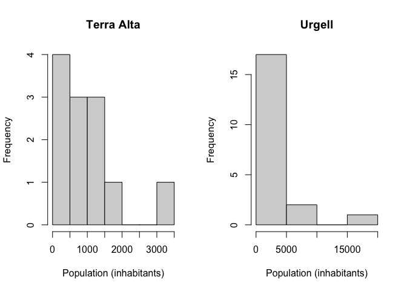
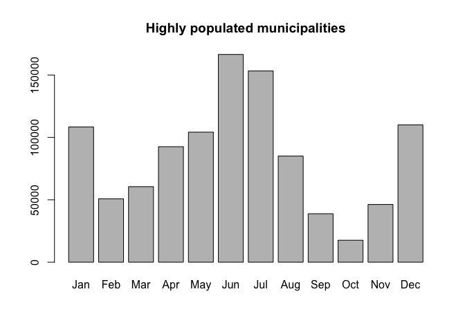

Objectives
==========

The learning objectives for this practical are:

-   How to create and use list objects.
-   How to perform implicit looping through lists.
-   Add new columns to data frames.
-   How to merge data frames.
-   Learn to explore and visualize data in different ways.

Setup and background
====================

To do this practical you need an installation of R and RStudio. You can
find the instructions in the [setup](/setup#r-and-rstudio) link on how
to install R and RStudio in your system. For a smooth development of
this practical, it is strongly recommended that you follow and finish
the previous [practical 7](/practical7/).

We will download COVID19 vaccination and demographic data for Catalonia
to illustrate some data wrangling in R and RStudio. Please follow the
next two steps:

-   **COVID19 vaccination by municipality**:

    1.  Go to the Catalan Health Departament COVID19 data portal at
        <https://dadescovid.cat> and switch the language to “ENGLISH”
        using the pull-down menu on the top-right corner of the page.
    2.  Follow the downloads link and on the next page, go to the
        section “Other Downloads” and click and download the “CSV” file
        corresponding to “Vaccination for COVID-19: administered doses
        by municipality”. Make sure you know exactly where in your
        filesystem this file has been downloaded. **Tip:** some browsers
        automatically download files into a folder called “Downloads” or
        under a name corresponding to the translation of “Downloads” to
        the default language of your operating system.
    3.  The service that hosts these data, the [Dades Obertes de
        Catalunya](https://governobert.gencat.cat/en/dades_obertes) data
        portal, provides this file as an uncompressed CSV file of over
        100MB large, which may take few minutes to download. You can
        download a compressed ZIP version of this file from this
        [link](Vacunaci__per_al_COVID-19__dosis_administrades_per_municipi.zip).
        Once downloaded, you will have to uncompress it to obtain the
        CSV file.
    4.  Make a directory in your filesystem, for instance at your *home*
        directory, called `practical8` and copy in it the downloaded
        file.
    5.  **Change the name of the file you just downloaded to
        `dosis_municipi.csv`**, so that you finally have a file called
        `dosis_municipi.csv` in the directory `practical8`.

-   **Population by municipality**:

    1.  Download the Catalan Urbanistic Map dataset at the [Dades
        Obertes de
        Catalunya](https://governobert.gencat.cat/en/dades_obertes) data
        portal. You should follow the following
        [link](https://analisi.transparenciacatalunya.cat/en/Urbanisme-infraestructures/Dades-del-mapa-urban-stic-de-Catalunya/epsm-zskb)
        and download the data by going to the top right corner and
        select “Export” and then “CSV”. This dataset includes
        information of the population of Catalonia by municipality.
    2.  Copy the downloaded file to the `practical8` directory and
        **change its name to `poblacio_municipis.csv`**.

If you are using the UPF [myapps](https://myapps.upf.edu) cloud to run
RStudio, then you need to either use an internet browser in *myapps* to
download the data file directly in the *myapps* cloud or upload to the
*myapps* cloud the file that you have downloaded in your own computer.

Reading and filtering data
==========================

Let’s load the CSV file `poblacio_municipis.csv`, which contains some
demographic indicators for the 948 municipalities in Catalonia such as
the population (column `Poblacio_padro`).

    > pop <- read.csv("poblacio_municipis.csv")
    > dim(pop)

    [1] 9480   69

    > head(pop, n=3)

       Any Codi_ine_5_txt Codi_ine_6_txt    NomMun    Comarca  AFT Costa
    1 2016           8111          81115     Malla      Osona   CC     0
    2 2017          25088         250886 Estamariu Alt Urgell APiA     0
    3 2021           8130          81304  Montclar   Berguedà   CC     0
              Muntanya Poblacio_padro Superficie_ha X05_SU X05_perce_SU X05_SUC
    1                             267      1097.097 2.8504       0.2598  0.0000
    2 Zona de muntanya            124      2116.372 3.2165       0.1520  3.2165
    3 Zona de muntanya            136      2190.623 1.3154       0.0000  1.3154
      X05_perce_SUC X05_SNC X05_perce_SNC X05_SURB X05_perce_SUR X05_SUD
    1         0.000  2.8504        0.2598   6.5897        0.6007  6.5897
    2         0.152  0.0000        0.0000   0.0000        0.0000  0.0000
    3         0.000  0.0000        0.0000   0.0000        0.0000  0.0000
      X05_perce_SUD X05_SND X05_perce_SND  X05_SNU X05_perce_SNU X06_Class_no_SNU
    1        0.6007       0             0 1087.657       99.1395           9.4401
    2        0.0000       0             0 2113.156       99.8480           3.2165
    3        0.0000       0             0 2189.307        0.0000           0.0000
      X06_perce_Class_no_snu X07_densitat_pob_km2 X08_densitat_pob_urba_Km2
    1                 0.8605              24.2431                  9367.203
    2                 0.1520               5.8591                  3855.155
    3                 0.0000               6.2115                 10338.793
      X09_Perce_SNC_SU X10_Perce_SUD_SU X11_Perce_SND_SU X012_Qual_SUC_AE
    1              100         231.1883                0                0
    2                0           0.0000                0                0
    3                0           0.0000                0                0
      X12_A1_SUC X12_A2_SUC X12_A3_SUC X13_Qual_SUC_R X13_R1_SUC X13_R2_SUC
    1          0          0          0         0.0000     0.0000          0
    2          0          0          0         2.2132     2.2132          0
    3          0          0          0         0.8306     0.8306          0
      X13_R3_SUC X13_R4_SUC X13_R5_SUC X13_R6_SUC X14_Qual_SUC_Altres X14_M1_SUC
    1          0          0          0          0                   0          0
    2          0          0          0          0                   0          0
    3          0          0          0          0                   0          0
      X14_M2_SUC X14_M3_SUC X15_Qual_SUC_SISTEMES X15_SA_SUC X15_SC_SUC X15_SD_SUC
    1          0          0                0.0000          0          0          0
    2          0          0                1.0047          0          0          0
    3          0          0                0.4855          0          0          0
      X15_SE_SUC X15_SF_SUC X15_SH_SUC X15_SP_SUC X15_SS_SUC X15_ST_SUC X15_SV_SUC
    1     0.0000          0          0          0          0     0.0000      0.000
    2     0.1239          0          0          0          0     0.0016      0.000
    3     0.0759          0          0          0          0     0.0064      0.128
      X15_SX0_SUC X15_SX1_SUC X15_SX2_SUC X16_QUAL_snu X16_N1_SNU X16_N2_SNU
    1           0      0.0000      0.0000     1055.158   836.9872   217.5711
    2           0      0.3854      0.4937     2060.441  1221.0300     0.0000
    3           0      0.2397      0.0355     2188.969  1906.6977     0.0000
      X16_N3_SNU X16_N4_SNU X17_Sol_resid_habt X18_Sol_AE_habt X19_Zverdes_habt
    1     0.0000     0.5993             0.0000               0           0.0000
    2   839.4111     0.0000           178.4855               0           0.0000
    3   282.2713     0.0000            61.0761               0           9.4124
      X20_Equip_habt
    1         0.0000
    2         9.9923
    3         5.5821

    > table(pop$Any)

    2012 2013 2014 2015 2016 2017 2018 2019 2020 2021 
     948  948  948  948  948  948  948  948  948  948 

We can observe that this dataset contains data from different years. To
continue with our analysis, we will select the most recent data
corresponding to 2021 and, moreover, we will only keep the columns
`Codi_ine_5_txt` (identifier for the municipality), `NomMun`, `Comarca`,
`Poblacio_padro` and `Superficie_ha`, corresponding to town identifier,
town name, county, population, town surface in
[hectare](https://en.wikipedia.org/wiki/Hectare) (ha), respectively.

    > ## build a logical mask to select for year 2021
    > mask <- pop$Any == 2021
    > ## build a character string vector of the selected columns
    > selcols <- c("Codi_ine_5_txt", "NomMun", "Comarca", "Poblacio_padro", "Superficie_ha")
    > ## subset the data.frame object 'pop' for rows in 'mask' and columns in 'selcols'
    > pop_sel <- pop[mask, selcols]
    > dim(pop_sel)

    [1] 948   5

    > head(pop_sel)

         Codi_ine_5_txt     NomMun          Comarca Poblacio_padro Superficie_ha
    3              8130   Montclar         Berguedà            136     2190.6228
    4             25145      Nalec           Urgell             88      966.6238
    1036          43061      Forès Conca de Barberà             48     1614.8126
    7752           8004     Alpens            Osona            269     1377.8822
    8140           8131 Montesquiu            Osona           1048      484.3796
    8154           8132  Montmajor         Berguedà            472     7572.4414

Lists and implicit looping
==========================

Lists allow one to group values through their elements. Let’s say we
want to group the population number by county. We can do that using the
function `split()` to which we should give a first argument of the
values we want to group and a second argument with the grouping factor.

    > pbyc <- split(pop_sel$Poblacio_padro, pop_sel$Comarca)
    > class(pbyc)

    [1] "list"

    > length(pbyc)

    [1] 42

    > names(pbyc)

     [1] "Alt Camp"          "Alt Empordà"       "Alt Penedès"      
     [4] "Alt Urgell"        "Alta Ribagorça"    "Anoia"            
     [7] "Bages"             "Baix Camp"         "Baix Ebre"        
    [10] "Baix Empordà"      "Baix Llobregat"    "Baix Penedès"     
    [13] "Barcelonès"        "Berguedà"          "Cerdanya"         
    [16] "Conca de Barberà"  "Garraf"            "Garrigues"        
    [19] "Garrotxa"          "Gironès"           "Maresme"          
    [22] "Moianès"           "Montsià"           "Noguera"          
    [25] "Osona"             "Pallars Jussà"     "Pallars Sobirà"   
    [28] "Pla d'Urgell"      "Pla de l'Estany"   "Priorat"          
    [31] "Ribera d'Ebre"     "Ripollès"          "Segarra"          
    [34] "Segrià"            "Selva"             "Solsonès"         
    [37] "Tarragonès"        "Terra Alta"        "Urgell"           
    [40] "Val d'Aran"        "Vallès Occidental" "Vallès Oriental"  

    > head(pbyc)

    $`Alt Camp`
     [1]   960  5185   478   695  1230   336   198   283   191   397   169   516
    [13]  2340   493  1196   544   575   507   402  1793 24553   705  1299

    $`Alt Empordà`
     [1]   267   178   205   885   619   998  1657    88  1015   752   271   941
    [13]   266  2820   305   618 11154   282   179   462   540 10497   412 47043
    [25]   793   464   909  3340   845  4842  1252   284   729   197  1434   369
    [37]   111  1490   588   187  1945   518   264  1095  1010   206   244 19921
    [49]   712   399   755   157  2083   378   865   212   334   726   914   969
    [61]   471  5480   162  1124   371  1154   761   244

    $`Alt Penedès`
     [1]  1597  1440  7723  2207  2419  3847  1923   915  1306   523   551  1004
    [13]  2459  3286  2411  2367 12840   378  7664  3149  1429  2479  1128 39969
    [25]  1701  1005  2452

    $`Alt Urgell`
     [1]   322   174    85   224    94    46   548   129  1081  1857   766   348
    [13]   947 12252   800   260   264   156   100

    $`Alta Ribagorça`
    [1] 1060 2331  554

    $Anoia
     [1]   653   322 40875   825   917  9623   158  3681   154 16411  3064  2207
    [13]   551   206   236   159  1236   344 10192   129  3852  1375   179 12736
    [25]   220    73  2177  1521  3597   194  5314   768   163

Grouping values can be useful in data analysis when we want to examine
the data separately by groups. Let’s say we want to visualize the
distribution of the population for the two counties `Terra Alta` and
`Urgell`, next to each other using a
[histogram](https://en.wikipedia.org/wiki/Histogram). We can use the
function `hist()` for that purpose, creating a grid of two plotting
panes using the `par()` function, as follows:

    > par(mfrow=c(1, 2))
    > hist(pbyc[["Terra Alta"]], xlab="Population (inhabitants)", main="Terra Alta")
    > hist(pbyc$Urgell, xlab="Population (inhabitants)", main="Urgell")

Note that in the previous code we are using the double-bracket operator
`[[` instead of the dollar `$` to access the element `Terra Alta`
because this element has an space character in its name.

**Exercise:** Try to interpret the previous plots, how many
municipalities in *Urgell* and *Terra Alta* have less than 5,000
inhabitants?

Now, let’s calculate the mean municipality population for the county of
*Terra Alta*. Having built the previous list object, we can make that
calculation applying the function `mean()` to the corresponding element
of the list:

    > mean(pbyc[["Terra Alta"]])

    [1] 950.0833

Now, let’s compare it with the mean municipality population for
*Urgell*:

    > mean(pbyc$Urgell)

    [1] 1863.8

It would be tedious to do that calculation for each different county by
writing one such function call for each element of the list. As an
alternative, we could use a `while` or `for` loop that would iterate
over the elements of the list. However, R provides a more compact way to
iterating over lists, and other objects, by using functions for
*implicit*
[looping](https://cran.r-project.org/doc/manuals/r-release/R-lang.html#Looping)
such as `lapply()` or `sapply()`. These functions take a list as a first
argument, iterate through each element of that list, and at each
iteration apply the function given in the second argument. Additional
arguments can be given and will be passed to the *applied* function.

The function `lapply()` returns again the input list with its elements
replaced by the result given by the function on each corresponding
element, while the function `sapply()` attempts to simplify the
resulting data structure in that if each element of the resulting list
has length 1, then it return an atomic vector.

We can calculate the mean municipality population per county with the
following call to the `sapply()` function:

    > sapply(pbyc, mean)

             Alt Camp       Alt Empordà       Alt Penedès        Alt Urgell 
            1958.4783         2114.1471         4080.4444         1076.4737 
       Alta Ribagorça             Anoia             Bages         Baix Camp 
            1315.0000         3760.9697         6032.0667         6967.7857 
            Baix Ebre      Baix Empordà    Baix Llobregat      Baix Penedès 
            5622.9286         3813.0000        27777.0667         7888.5000 
           Barcelonès          Berguedà          Cerdanya  Conca de Barberà 
          456193.4000         1290.4516         1131.1765          913.8182 
               Garraf         Garrigues          Garrotxa           Gironès 
           25710.6667          792.0833         2817.2857         7027.4286 
              Maresme           Moianès           Montsià           Noguera 
           15320.8333         1424.3000         5699.7500         1305.6333 
                Osona     Pallars Jussà    Pallars Sobirà      Pla d'Urgell 
            3281.5400          940.7143          473.4000         2298.0625 
      Pla de l'Estany           Priorat     Ribera d'Ebre          Ripollès 
            2988.7273          401.6957         1561.7143         1339.4211 
              Segarra            Segrià             Selva          Solsonès 
            1114.8571         5568.6579         6757.7692          906.6667 
           Tarragonès        Terra Alta            Urgell        Val d'Aran 
           11909.1364          950.0833         1863.8000         1152.4444 
    Vallès Occidental   Vallès Oriental 
           40757.4783        10661.2564 

**Exercise:** calculate the total population per county and the total
population in Catalonia.

Sorting and ordering
====================

We have two functions in R that allow us to rearrange values in
particular order:

-   `sort()` returns the ordered values.
-   `order()` returns a permutation which rearranges its first argument
    into ascending or descending order.

By default, these functions return an ascending order, but by setting
the argument `decreasing=TRUE`, we can obtain a descending order.

**Exercise:** Using the previous functions `sort()` and `order()` and
the columns `NomMun` (town name) and `Poblacio_padro` (town population),
find out how many inhabitants have the three most and three least
populated municipalities and their names.

Adding new columns
==================

In some cases we might be interested in deriving new data columns from
the existing ones. For instance, let’s say we want to add a new column
to the previous `data.frame` object `pop_sel` that stores the population
density of each municipality in inhabitants per [squared kilometer
(Km2)](https://en.wikipedia.org/wiki/Square_kilometre). The column
`Superficie_ha` contains the area occupied by the municipality in
[hectares](https://en.wikipedia.org/wiki/Hectare) (ha), let’s convert it
first to Km2:

    > km2 <- pop_sel$Superficie_ha / 100

Finally, let’s calculate the population density dividing the number of
inhabitants by the area occupied by the municipality in Km2 and add it
to `pop_sel` as a new column called `density`:

    > pop_sel$Density <- pop_sel$Poblacio_padro / km2
    > head(pop_sel)

         Codi_ine_5_txt     NomMun          Comarca Poblacio_padro Superficie_ha
    3              8130   Montclar         Berguedà            136     2190.6228
    4             25145      Nalec           Urgell             88      966.6238
    1036          43061      Forès Conca de Barberà             48     1614.8126
    7752           8004     Alpens            Osona            269     1377.8822
    8140           8131 Montesquiu            Osona           1048      484.3796
    8154           8132  Montmajor         Berguedà            472     7572.4414
            Density
    3      6.208280
    4      9.103852
    1036   2.972481
    7752  19.522714
    8140 216.359236
    8154   6.233128

Let’s say we want to visualize the relationship between population
density and absolute population, highlighting the two municipalities
with highest population and density. We can do that using the functions
`plot()` and `text()` as follows.

    > plot(pop_sel$Poblacio_padro, pop_sel$Density, xlab="Population (inhabitants)",
    +      ylab="Population density")
    > whmaxpop <- which.max(pop_sel$Poblacio_padro)
    > whmaxden <- which.max(pop_sel$Density)
    > text(pop_sel$Poblacio_padro[whmaxpop], pop_sel$Density[whmaxpop],
    +      pop_sel$NomMun[whmaxpop], pos=2)
    > text(pop_sel$Poblacio_padro[whmaxden], pop_sel$Density[whmaxden],
    +      pop_sel$NomMun[whmaxden], pos=1)

Note that in the previous code we have used the function `which.max()`
to obtain the position in the input vector that contains the maximum
value.

Combining data
==============

One of the most common operations required to answer a question with
data is to combine two datasets in some way. Let’s say we want to
compare municipalities in terms of how many vaccine doses per 100,000
inhabitants have been administered. For that purpose, we load a second
dataset corresponding to the administered COVID19 vaccine doses by
municipality in Catalonia (`dosis_municipi.csv`) as follows.

    > vac <- read.csv("dosis_municipi.csv", sep=";", stringsAsFactors=FALSE)
    > dim(vac)

    [1] 1176958      15

    > head(vac)

      SEXE_CODI SEXE PROVINCIA_CODI      PROVINCIA COMARCA_CODI         COMARCA
    1         0 Home             17         Girona            2     ALT EMPORDA
    2         0 Home              8      Barcelona           41 VALLES ORIENTAL
    3         0 Home             NA No classificat           NA  No classificat
    4         0 Home              8      Barcelona           14        BERGUEDA
    5         0 Home             25         Lleida            5  ALTA RIBAGORÇA
    6         0 Home             43      Tarragona           36      TARRAGONES
      MUNICIPI_CODI                MUNICIPI DISTRICTE_CODI      DISTRICTE DOSI
    1         17182 SANTA LLOGAIA D'ÀLGUEMA             NA No classificat    1
    2          8294            VALLGORGUINA             NA No classificat    1
    3            NA      (Altres municipis)             NA No classificat    1
    4          8299                  VILADA             NA No classificat    1
    5         25173        EL PONT DE SUERT             NA No classificat    1
    6         43095               EL MORELL             NA No classificat    2
            DATA            FABRICANT NO_VACUNAT RECOMPTE
    1 28/06/2021    BioNTech / Pfizer                   2
    2 01/04/2021 Oxford / AstraZeneca                   2
    3 14/05/2021      No administrada No vacunat        8
    4 07/01/2022      Moderna / Lonza                   1
    5 01/04/2021 Oxford / AstraZeneca                   4
    6 31/03/2021    BioNTech / Pfizer                   2

The column `FABRICANT` contains the vaccine manufacturer. Let’s tally
the number of administered doses per manufacturer.

    > table(vac$FABRICANT)

          BioNTech / Pfizer Hipra Scientific S.L.U.           J&J / Janssen 
                     549969                     135                   34542 
            Moderna / Lonza         No administrada                 Novavax 
                     368931                  103373                      14 
       Oxford / AstraZeneca 
                     119994 

The value `No administrada` corresponds to non-administered vaccine
doses. Let’s discard those and work with the corresponding subset of the
data in a `data.frame` object called `vac_admin`.

    > mask <- vac$FABRICANT !="No administrada"
    > vac_admin <- vac[mask, ]
    > dim(vac_admin)

    [1] 1073585      15

We want to combine the filtered vaccination data with the population
data.

    > dim(vac_admin)

    [1] 1073585      15

    > colnames(vac_admin)

     [1] "SEXE_CODI"      "SEXE"           "PROVINCIA_CODI" "PROVINCIA"     
     [5] "COMARCA_CODI"   "COMARCA"        "MUNICIPI_CODI"  "MUNICIPI"      
     [9] "DISTRICTE_CODI" "DISTRICTE"      "DOSI"           "DATA"          
    [13] "FABRICANT"      "NO_VACUNAT"     "RECOMPTE"      

    > dim(pop_sel)

    [1] 948   6

    > colnames(pop_sel)

    [1] "Codi_ine_5_txt" "NomMun"         "Comarca"        "Poblacio_padro"
    [5] "Superficie_ha"  "Density"       

Note that both datasets have different dimensions and different column
names, so we need combine them using some column that is common in both
datasets. Because our purpose is to compare vaccination rates among
municipalities, we should expect that the name of the municipality could
be use to combine both datasets.

    > head(vac_admin$MUNICIPI)

    [1] "SANTA LLOGAIA D'ÀLGUEMA" "VALLGORGUINA"           
    [3] "VILADA"                  "EL PONT DE SUERT"       
    [5] "EL MORELL"               "AIGUAFREDA"             

    > head(pop_sel$NomMun)

    [1] "Montclar"   "Nalec"      "Forès"      "Alpens"     "Montesquiu"
    [6] "Montmajor" 

However, in the first dataset the name of the municipalities is all in
uppercase, while in the second is a combination of upper and lower
cases. As R compares characters in a case-sensitive manner, we won’t be
able to use directly these values to combine the data frames as we can
see from the following attempt to match names.

    > mt <- match(vac_admin$MUNICIPI, pop_sel$NomMun)
    > head(mt, n=20)

     [1] NA NA NA NA NA NA NA NA NA NA NA NA NA NA NA NA NA NA NA NA

However, both datasets also have a column with a municipality code:

    > head(vac_admin$MUNICIPI_CODI)

    [1] 17182  8294  8299 25173 43095  8014

    > head(pop_sel$Codi_ine_5_txt)

    [1]  8130 25145 43061  8004  8131  8132

    > mt <- match(vac_admin$MUNICIPI_CODI, pop_sel$Codi_ine_5_txt)
    > head(mt, n=20)

     [1] 431 247 252 631 804 902 907 647  86 328 213 112 784 918  93 218 676 854 372
    [20] 676

Once we know what column in each dataset can be used to combine them, we
can use the `merge()` function, which by default will return only rows
with common values in those two columns. By default, this function will
combine data using columns with identical names. Since in our datasets
the two columns with the common information are named differently, we
need to specify which are these columns in each `data.frame` object by
using the arguments `by.x` and `by.y`.

    > vac_pop_merge <- merge(vac_admin, pop_sel, 
    +                        by.x = "MUNICIPI_CODI", by.y = "Codi_ine_5_txt")
    > dim(vac_pop_merge)

    [1] 1067744      20

    > head(vac_pop_merge)

      MUNICIPI_CODI SEXE_CODI SEXE PROVINCIA_CODI PROVINCIA COMARCA_CODI
    1          8001         1 Dona              8 Barcelona           11
    2          8001         0 Home              8 Barcelona           11
    3          8001         1 Dona              8 Barcelona           11
    4          8001         1 Dona              8 Barcelona           11
    5          8001         0 Home              8 Barcelona           11
    6          8001         0 Home              8 Barcelona           11
             COMARCA MUNICIPI DISTRICTE_CODI      DISTRICTE DOSI       DATA
    1 BAIX LLOBREGAT   ABRERA             NA No classificat    1 30/06/2021
    2 BAIX LLOBREGAT   ABRERA             NA No classificat    2 28/07/2021
    3 BAIX LLOBREGAT   ABRERA             NA No classificat    1 04/11/2021
    4 BAIX LLOBREGAT   ABRERA             NA No classificat    1 23/02/2021
    5 BAIX LLOBREGAT   ABRERA             NA No classificat    2 15/09/2021
    6 BAIX LLOBREGAT   ABRERA             NA No classificat    1 31/03/2021
                 FABRICANT NO_VACUNAT RECOMPTE NomMun        Comarca Poblacio_padro
    1        J&J / Janssen                  19 Abrera Baix Llobregat          12620
    2    BioNTech / Pfizer                   4 Abrera Baix Llobregat          12620
    3    BioNTech / Pfizer                   1 Abrera Baix Llobregat          12620
    4 Oxford / AstraZeneca                   9 Abrera Baix Llobregat          12620
    5    BioNTech / Pfizer                   3 Abrera Baix Llobregat          12620
    6      Moderna / Lonza                   1 Abrera Baix Llobregat          12620
      Superficie_ha  Density
    1      1995.254 632.5011
    2      1995.254 632.5011
    3      1995.254 632.5011
    4      1995.254 632.5011
    5      1995.254 632.5011
    6      1995.254 632.5011

Now the number of rows of the output data frame `vac_pop_merge` is
slightly smaller than `vac_admin`, because it doesn’t keep rows that
didn’t find a match in `pop_sel`.

**Exercise:** Using `vac_pop_merge`, add a new column named
`doses_100K_h` containing how many vaccine doses were administered each
day per 100,000 inhabitants. The column `RECOMPTE` contains the number
of administered doses. Which towns administered the highest and the
lowest rate of vaccine doses per 100,000 inhabitants, from what vaccine
manufacturer and at which date.

To continue with our analysis, we need to add a column containing a
month as a factor. Thus, we repeat the steps explained in the previous
[practical 7](/practical7/) to convert the column `DATA` to a date,
extract the months and convert them to a factor with ordered levels:

    > vac_pop_merge$month <- months(as.Date(vac_pop_merge$DATA), abbreviate=TRUE)
    > vac_pop_merge$month <- factor(vac_pop_merge$month,
    +                               levels=c("Jan", "Feb", "Mar", "Apr", "May", "Jun",
    +                                        "Jul", "Aug", "Sep", "Oct", "Nov", "Dec"))

Next, we will select the towns with high population (more than 200,000
residents) and save them into a data frame called `vac_high`. Now we
want to obtain the total vaccine doses administered per inhabitant every
month in these specific towns. Again, we take advantege of the
combination of `split` and `sapply` to do this calculation. Finally, we
create a new data frame with the summarised data, including a column
called `muni_type` that identifies the type of municipalities (“High” as
in “High population”) used for extracting this values.

    > vac_high <- vac_pop_merge[vac_pop_merge$Poblacio_padro > 200000,]
    > dosesh_high <- split(vac_high$doses_100K_h, vac_high$month)
    > 
    > total_dosesh_high <- sapply(dosesh_high, sum)
    > 
    > df_high <- data.frame("month"=names(total_dosesh_high),
    +                       "doses_h"=total_dosesh_high,
    +                       "muni_type"="High")
    > 
    > barplot(df_high$doses_h, names.arg = df_high$month,
    +         main="Highly populated municipalities")

**Exercise**: Create a data frame named `df_low` that contains the total
doses per 100,000 inhabitants administered per month in municipalities
with population smaller than 1,000 inhabitants. Make a bar plot showing
the administered doses per inhabitant per month, as we did above.

**Exercise**: Combine the data frames `df_high` and `df_low` into a
single data frame named `df_months` (**Hint**: Make sure that `df_high`
and `df_low` have the same columns, with the same name and in the same
order). Then make a box plot showing the distribution of doses per
inhabitant grouped by the type of municipality (low or high). Do you see
any difference?
